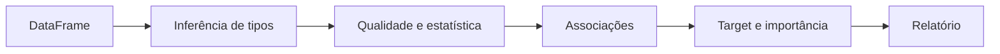

# SmartEDA

[](https://www.python.org/)
[](pyproject.toml)
[](#licença)

Biblioteca Python para análise exploratória automatizada de DataFrames pandas. O SmartEDA combina inferência de tipos, estatística descritiva, qualidade de dados, associações entre variáveis, análise de target e relatórios reproduzíveis.

> Projeto de portfólio que une fundamentos estatísticos e práticas de engenharia Python para acelerar a primeira leitura de um dataset.

## Capacidades

- inferência de variáveis numéricas, categóricas, temporais, binárias e identificadores;
- estatísticas descritivas, percentis, assimetria, outliers e valores ausentes;
- análise categórica com cardinalidade, entropia e categorias raras;
- correlações de Pearson, Cramér's V e Eta-squared para tipos mistos;
- análise de target para classificação e regressão;
- ranking de importância com sinais estatísticos e Random Forest;
- relatórios Markdown com gráficos;
- amostragem reprodutível para bases maiores;
- instalação via `pyproject.toml`, testes e CI.

## Instalação

### Uso como biblioteca

```bash
git clone https://github.com/viniciusds2020/sistema_eda.git
cd sistema_eda
python -m venv .venv

# Linux/macOS
source .venv/bin/activate
# Windows
# .venv\Scripts\activate

pip install -e .
```

### Ambiente de desenvolvimento

```bash
pip install -e ".[dev]"
ruff check .
pytest --cov=smarteda --cov-report=term-missing
```

## Uso rápido

```python
import pandas as pd
from smarteda import SmartEDA

df = pd.read_csv("clientes.csv")

eda = SmartEDA(df, dataset_name="Clientes")
results = eda.analyze()
eda.generate_report("reports/clientes.md")

print(eda.get_numeric_summary())
print(eda.get_categorical_summary())
```

## Análise supervisionada

Ao informar uma variável-alvo, o SmartEDA analisa relações com as features e cria um ranking de importância.

```python
from smarteda import Config, SmartEDA

config = Config(
    categorical_threshold=15,
    correlation_threshold=0.30,
    include_plots=True,
    sample_size=100_000,
    random_state=42,
)

eda = SmartEDA(
    df,
    target="inadimplente",
    config=config,
    dataset_name="Risco de crédito",
)

eda.analyze()
print(eda.get_target_summary())
print(eda.get_importance_summary())
eda.generate_report("reports/risco_credito.md")
```

## Fluxo analítico



## API principal

| Método | Resultado |
|---|---|
| `analyze()` | Executa a análise e retorna os resultados estruturados |
| `generate_report(path)` | Gera relatório Markdown e artefatos visuais |
| `get_numeric_summary()` | Retorna resumo de variáveis numéricas |
| `get_categorical_summary()` | Retorna resumo de variáveis categóricas |
| `get_correlation_summary()` | Retorna associações relevantes |
| `get_target_summary()` | Retorna análise da variável-alvo |
| `get_importance_summary()` | Retorna ranking de importância |

## Estrutura

```text
smarteda/
├── core/              # orquestração, configuração e inferência
├── analysis/          # análises numérica, categórica, temporal e de target
├── report/            # geração e estilos do relatório
└── utils/             # funções auxiliares
tests/                 # testes de API e pipeline básico
.github/workflows/     # validação automática
pyproject.toml         # pacote e ferramentas de desenvolvimento
main.py                # demonstração com dados sintéticos
```

## Considerações estatísticas

- Correlação indica associação, não causalidade.
- Importância de variável não é evidência causal e pode refletir colinearidade ou leakage.
- MAPE, outliers, missing values e tipos inferidos devem ser interpretados com conhecimento do domínio.
- Amostragem reduz custo, mas pode ocultar segmentos raros: use `random_state` para reprodutibilidade.
- Para modelagem, separe treino e teste antes de qualquer transformação que aprenda parâmetros dos dados.

## Limitações e próximos passos

O SmartEDA é uma ferramenta de diagnóstico inicial, não substitui revisão estatística especializada. Próximas evoluções previstas:

- [ ] relatório HTML interativo;
- [ ] suporte a Polars e DuckDB;
- [ ] detector de possíveis IDs, leakage e variáveis constantes;
- [ ] data profiling entre treino e teste;
- [ ] publicação no PyPI e documentação de API.

## Licença

MIT.

## Autor

Desenvolvido por [Vinicius de Sousa](https://github.com/viniciusds2020).
