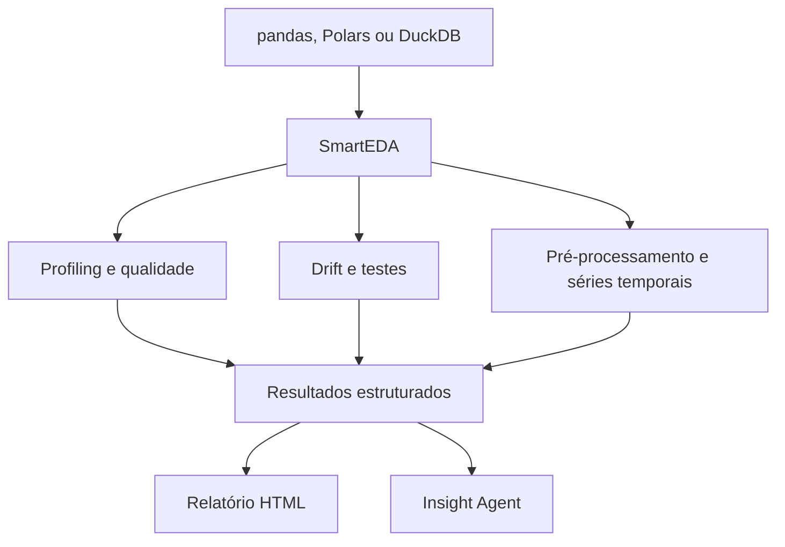

<div align="center">

# SmartEDA

### Statistical data profiling, drift monitoring and AI-assisted insights

Biblioteca Python para transformar análise exploratória em diagnósticos estatísticos reproduzíveis, recomendações de pré-processamento e relatórios interativos.

[](https://www.python.org/)
[](#)
[](https://pandas.pydata.org/)
[](https://pola.rs/)
[](https://duckdb.org/)
[](#licença)

</div>

## Visão geral

O SmartEDA reúne em uma única API:

- análise exploratória numérica, categórica, temporal e supervisionada;
- diagnóstico de qualidade, possíveis IDs, constantes e target leakage;
- comparação entre treino e teste com métricas e testes de drift;
- correção para múltiplas comparações;
- drift condicionado ao target e monitoramento longitudinal;
- sugestões de pré-processamento baseadas em evidências;
- diagnóstico específico para séries temporais;
- relatórios Markdown e HTML interativos;
- agente opcional com regras locais ou Groq/Llama.

A biblioteca não transforma os dados automaticamente. Ela produz resultados estruturados e recomendações auditáveis para que decisões de tratamento sejam validadas no contexto do problema.

## Capacidades

| Pilar | Recursos |
|---|---|
| Profiling | estatísticas descritivas, tipos inferidos, missing, duplicadas, outliers e associações |
| Qualidade | constantes, possíveis IDs e alertas heurísticos de leakage |
| Associação | Pearson, Cramér's V, Eta-squared, ANOVA e rankings supervisionados |
| Drift | PSI, Jensen–Shannon, missing drift, categorias inéditas e mudança de schema |
| Inferência | KS, qui-quadrado, Benjamini–Hochberg FDR e Bonferroni |
| Target | drift por classe ou faixa, desbalanceamento e associação da ausência com o target |
| Pré-processamento | imputação, scaling, transformações, encoding e ações priorizadas |
| Séries temporais | frequência, gaps, tendência, autocorrelação, sazonalidade, ADF e target shift |
| Escala | pandas, Polars DataFrame/LazyFrame e DuckDB Relation |
| Entrega | resultados Python, Markdown, HTML interativo e Insight Agent |

## Arquitetura



Para Polars LazyFrame e DuckDB Relation, o limite de linhas é aplicado antes da coleta. A análise estatística utiliza pandas internamente após a materialização controlada.

## Instalação

### Instalação completa

```bash
git clone https://github.com/viniciusds2020/sistema_eda.git
cd sistema_eda
python -m venv .venv
source .venv/bin/activate
pip install -e ".[all]"
```

No Windows:

```powershell
.venv\Scripts\activate
pip install -e ".[all]"
```

### Extras disponíveis

| Extra | Finalidade |
|---|---|
| `polars` | Polars DataFrame e LazyFrame |
| `duckdb` | DuckDB Relation |
| `timeseries` | teste ADF com statsmodels |
| `all` | todos os conectores e diagnóstico temporal completo |
| `dev` | pytest, cobertura e Ruff |

## Início rápido

```python
from smarteda import Config, SmartEDA

eda = SmartEDA(
    train_df,
    target="inadimplente",
    dataset_name="Risco de crédito",
    config=Config(
        sample_size=200_000,
        statistical_alpha=0.05,
        pvalue_correction="fdr_bh",
        min_segment_size=100,
        include_plots=False,
    ),
)

results = eda.analyze()
eda.generate_html_report("reports/eda.html")
```

O `analyze()` executa o profiling principal e adiciona automaticamente diagnósticos de qualidade, pré-processamento e séries temporais quando houver colunas compatíveis.

## Workflow de monitoramento

```python
train_test = eda.profile_train_test(test_df)

statistical_tests = eda.run_distribution_tests(
    test_df,
    correction="fdr_bh",
    alpha=0.05,
)

conditioned = eda.profile_target_conditioned(
    test_df,
    target_bins=5,
    min_samples=100,
)

history = eda.monitor_windows(
    {
        "2026-01": janeiro_df,
        "2026-02": fevereiro_df,
        "2026-03": marco_df,
    }
)

eda.generate_html_report("reports/monitoring.html")
```

### Testes e métricas

| Tipo de variável | Comparação | Tamanho de efeito ou indicador |
|---|---|---|
| Numérica | KS de duas amostras | estatística KS e PSI |
| Categórica | qui-quadrado de homogeneidade | Cramér's V e Jensen–Shannon |
| Missingness × target categórico | qui-quadrado | p-valor ajustado por FDR |
| Missingness × target contínuo | Mann–Whitney | p-valor ajustado por FDR |

O drift condicionado separa targets discretos por classe e targets contínuos por quantis calculados na referência. Isso ajuda a localizar mudanças concentradas em segmentos de risco, valor ou comportamento.

## Diagnóstico de pré-processamento

```python
preprocessing = results["preprocessing_diagnostics"]

preprocessing["missing_data"]
preprocessing["outliers"]
preprocessing["normality_tests"]
preprocessing["target_actions"]
preprocessing["prioritized_actions"]
```

O diagnóstico inclui:

- taxa de ausência e estratégia sugerida por tipo e distribuição;
- associação da ausência com o target;
- correção Benjamini–Hochberg para os testes de missingness;
- outliers por IQR e percentual afetado;
- Shapiro–Wilk com amostragem limitada;
- sugestões de `StandardScaler`, `RobustScaler`, `log1p` e Yeo–Johnson;
- recomendações para targets desbalanceados;
- ações priorizadas acompanhadas da evidência utilizada.

Imputadores, encoders, scalers e resampling devem ser ajustados dentro de cada fold de treino. As recomendações não alteram o DataFrame original.

## Séries temporais

Quando uma coluna temporal é identificada, o SmartEDA gera:

```python
temporal = results["time_series_diagnostics"]

temporal["time_axes"]
temporal["signals"]
temporal["target_temporal_analysis"]
temporal["prioritized_actions"]
```

O diagnóstico cobre:

- frequência inferida, regularidade e intervalo mediano;
- timestamps inválidos, ausentes e duplicados;
- gaps e necessidade de reindexação;
- tendência monotônica por Spearman;
- autocorrelação de primeira ordem e autocorrelação sazonal;
- mudança padronizada entre períodos;
- teste ADF opcional para estacionariedade;
- mudança temporal do target em classificação e regressão.

As ações recomendam rolling-origin ou `TimeSeriesSplit`, criação de lags com deslocamento, rolling features sem informação futura e ajuste do pré-processamento por janela de treino.

```bash
pip install -e ".[timeseries]"
```

Sem esse extra, os demais diagnósticos temporais continuam disponíveis e o ADF é marcado como indisponível.

## SmartEDA Insight Agent

O agente interpreta os resultados agregados do SmartEDA. Ele não recebe linhas do dataset.

### Modo determinístico e local

```python
insights = eda.generate_insights(provider="rules")
answer = eda.ask("Quais ações você recomenda?")

eda.generate_html_report(
    "reports/eda_with_insights.html",
    enable_agent=True,
)
```

### Groq com modelo Llama configurável

```bash
export GROQ_API_KEY="sua-chave"
```

```python
insights = eda.generate_insights(
    provider="groq",
    model="llama-3.3-70b-versatile",
)

answer = eda.ask(
    "Quais variáveis representam maior risco para o modelo?",
    provider="groq",
)

eda.generate_html_report(
    "reports/eda_with_insights.html",
    enable_agent=True,
    agent_provider="groq",
)
```

### Privacidade e economia de tokens

Antes da chamada externa, o SmartEDA:

- seleciona apenas seções estatísticas permitidas;
- rejeita DataFrames brutos;
- limita quantidade de itens e tamanho dos textos;
- remove marcação potencialmente maliciosa;
- envia contexto JSON compacto;
- mantém a chave Groq somente no ambiente Python.

A resposta gerada pode ser incorporada ao HTML, mas a credencial nunca é gravada no relatório.

## Escala e materialização

```python
from smarteda import Config, SmartEDA

eda = SmartEDA(
    polars_lazyframe,
    config=Config(sample_size=200_000),
)
```

| Fonte | Estratégia |
|---|---|
| pandas | amostragem aleatória reprodutível |
| Polars DataFrame | `sample()` antes da conversão |
| Polars LazyFrame | `limit()` antes de `collect()` |
| DuckDB Relation | `limit()` antes de `.df()` |

O `sample_size` limita a materialização, mas não transforma o SmartEDA em um motor distribuído. O tamanho da amostra deve ser definido considerando memória, estabilidade das métricas e representatividade.

## Resultados estruturados

| Chave | Conteúdo |
|---|---|
| `overview` | dimensões, missing, duplicadas e memória |
| `quality_diagnostics` | constantes, IDs e possíveis leakages |
| `numeric_stats` | estatísticas, outliers e normalidade |
| `categorical_stats` | frequências, entropia e categorias raras |
| `target_analysis` | relações e ranking supervisionado |
| `preprocessing_diagnostics` | sugestões e ações priorizadas |
| `time_series_diagnostics` | estrutura temporal, sinais e target shift |
| `train_test_profile` | drift entre referência e comparação |
| `statistical_drift_tests` | testes, efeitos e p-valores corrigidos |
| `target_conditioned_drift` | drift dentro dos segmentos do target |
| `longitudinal_monitoring` | histórico por janela e variável |
| `ai_insights` | resumo e recomendações do agente |

## Relatórios

```python
eda.generate_report("reports/eda.md")

eda.generate_html_report(
    "reports/eda.html",
    enable_agent=True,
    agent_provider="rules",
)
```

O HTML é autocontido e reúne cartões de qualidade, tabelas estatísticas, gráficos Plotly, drift, pré-processamento, séries temporais e insights.

## Princípios estatísticos

- significância estatística não implica relevância prática;
- p-valores devem ser interpretados com tamanho de efeito;
- grandes amostras tornam testes mais sensíveis;
- PSI e Jensen–Shannon são indicadores operacionais, não testes causais;
- normalidade não é requisito para todos os modelos;
- outliers podem representar erro, evento raro ou sinal de negócio;
- condicionamento no target é diagnóstico e não substitui métricas do modelo;
- limites, janelas e estratégias devem ser calibrados por domínio.

## Desenvolvimento

```bash
pip install -e ".[dev,all]"
ruff check smarteda tests
pytest --cov=smarteda --cov-report=term-missing
```

## Limitações conhecidas

- a análise principal é executada em pandas após materialização controlada;
- as sugestões de pré-processamento não constituem um pipeline treinado;
- o agente produz interpretação, não causalidade;
- o ADF requer o extra `timeseries`;
- alertas de ID e leakage são heurísticos e exigem validação de domínio.

## Licença

Distribuído sob a licença MIT.

## Autor

Desenvolvido por [Vinicius de Sousa](https://github.com/viniciusds2020).

Se este projeto for útil, considere marcar o repositório com uma estrela.

