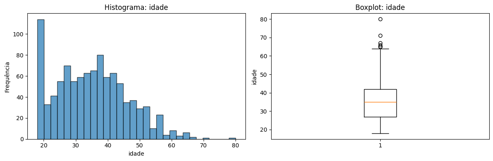
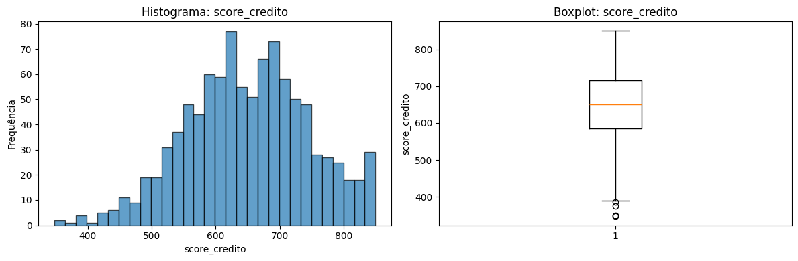
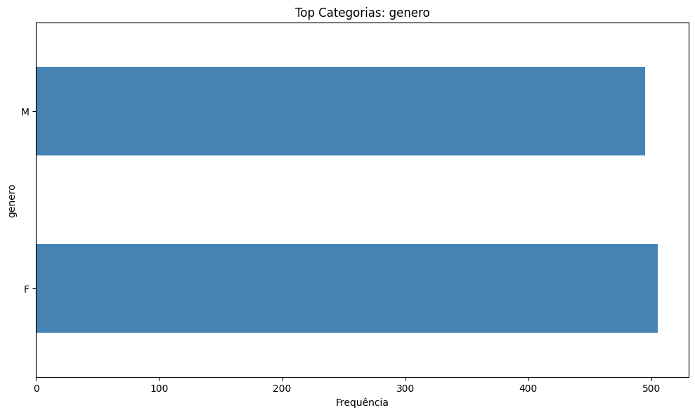
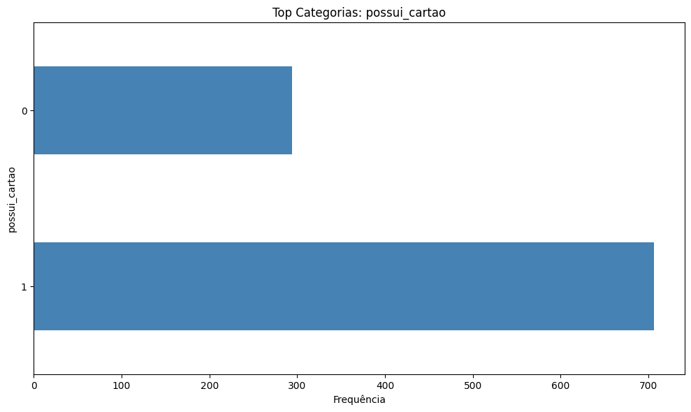
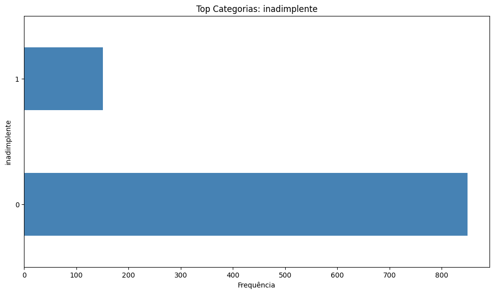
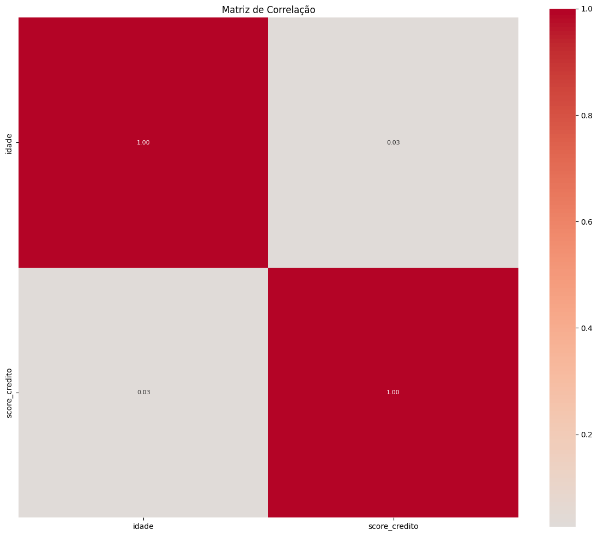

# 📊 Relatório de Análise Exploratória

**Dataset:** Predição de Renda
**Gerado em:** 2026-01-30 17:59:55
**Gerado por:** SmartEDA Python

---

## ℹ Sumário Executivo

| Métrica | Valor |
|---------|-------|
| Linhas | 1,000 |
| Colunas | 14 |
| Numéricas | 2 |
| Categóricas | 3 |
| Temporais | 1 |
| % Ausentes | 0.7% |
| Duplicadas | 0 |

## 📋 Visão Geral dos Dados

### Estrutura do Dataset

| Coluna | Tipo Original | Tipo Inferido | Únicos | Ausentes |
| --- | --- | --- | --- | --- |
| id_cliente | int64 | id | 1000 | 0.0% |
| idade | int64 | numeric_discrete | 51 | 0.0% |
| genero | str | binary | 2 | 0.0% |
| estado_civil | str | unknown | 4 | 0.0% |
| escolaridade | str | unknown | 4 | 2.3% |
| regiao | str | unknown | 5 | 0.0% |
| renda_mensal | float64 | id | 953 | 4.7% |
| score_credito | float64 | numeric_continuous | 355 | 2.1% |
| tempo_emprego_anos | float64 | id | 1000 | 0.0% |
| tipo_cliente | str | unknown | 4 | 0.0% |
| possui_cartao | int64 | binary | 2 | 0.0% |
| valor_ultima_compra | float64 | id | 1000 | 0.0% |
| data_cadastro | datetime64[us] | datetime | 728 | 0.0% |
| inadimplente | int64 | binary | 2 | 0.0% |

## 🏷️ Inferência de Tipos

### Distribuição por Tipo

- **id**: 4 colunas
- **numeric_discrete**: 1 colunas
- **binary**: 3 colunas
- **unknown**: 4 colunas
- **numeric_continuous**: 1 colunas
- **datetime**: 1 colunas

## 🔢 Análise de Variáveis Numéricas

### Estatísticas Descritivas

| Variável | N | Média | Mediana | Desvio | Mín | Máx | Assimetria | Outliers |
| --- | --- | --- | --- | --- | --- | --- | --- | --- |
| idade | 1000 | 35.10 | 35.00 | 11.08 | 18.00 | 80.00 | 0.40 | 7 |
| score_credito | 979 | 649.54 | 650.00 | 96.20 | 348.00 | 850.00 | -0.10 | 4 |

### Percentis

| Variável | p1 | p5 | p25 | p50 | p75 | p95 | p99 |
| --- | --- | --- | --- | --- | --- | --- | --- |
| idade | 18.00 | 18.00 | 27.00 | 35.00 | 42.00 | 55.00 | 62.02 |
| score_credito | 425.78 | 493.00 | 585.00 | 650.00 | 716.00 | 812.20 | 850.00 |

### Distribuições

## 🏷️ Análise de Variáveis Categóricas

### Resumo

| Variável | N | Únicos | Moda | Moda% | Entropia | Raros |
| --- | --- | --- | --- | --- | --- | --- |
| genero | 1000 | 2 | F | 50.5% | 1.00 | 0 |
| possui_cartao | 1000 | 2 | 1 | 70.6% | 0.87 | 0 |
| inadimplente | 1000 | 2 | 0 | 84.9% | 0.61 | 0 |

### Top Categorias por Variável

#### genero

| Categoria | Contagem | Percentual |
| --- | --- | --- |
| F | 505 | 50.5% |
| M | 495 | 49.5% |

#### possui_cartao

| Categoria | Contagem | Percentual |
| --- | --- | --- |
| 1 | 706 | 70.6% |
| 0 | 294 | 29.4% |

#### inadimplente

| Categoria | Contagem | Percentual |
| --- | --- | --- |
| 0 | 849 | 84.9% |
| 1 | 151 | 15.1% |

### Distribuições

## 📅 Análise de Variáveis Temporais

### Resumo

| Variável | N | Início | Fim | Range | Tem Hora | Gaps |
| --- | --- | --- | --- | --- | --- | --- |
| data_cadastro | 1000 | 2020-01-05 | 2024-02-04 | 4.1 anos | Não | 4 |

## 🔗 Análise de Correlações

### Matriz de Correlação

## 🎯 Análise com Variável Target

**Target:** renda_mensal
**Tipo:** regression

### Ranking de Features por Importância

| # | Feature | Tipo | Métrica | Valor | Interpretação |
| --- | --- | --- | --- | --- | --- |
| 1 | idade | numeric | Correlação Pearson | -0.0112 | Correlação não significativa (negativa) |
| 2 | inadimplente | categorical | Eta-squared | 0.0059 | Efeito pequeno |
| 3 | score_credito | numeric | Correlação Pearson | -0.0053 | Correlação não significativa (negativa) |
| 4 | genero | categorical | Eta-squared | 0.0013 | Sem diferença significativa entre grupos |
| 5 | possui_cartao | categorical | Eta-squared | 0.0002 | Sem diferença significativa entre grupos |

## ⭐ Importância de Variáveis

### Ranking Consolidado

| # | Feature | Tipo | Mutual Info | Score |
| --- | --- | --- | --- | --- |
| 1 | idade | numeric | - | 0.6000 |
| 2 | inadimplente | categorical | 0.0368 | 0.6000 |
| 3 | score_credito | numeric | 0.0017 | 0.4000 |
| 4 | possui_cartao | categorical | 0.0127 | 0.1732 |
| 5 | genero | categorical | 0.0030 | 0.0000 |

---

*Relatório gerado automaticamente pelo SmartEDA Python em 2026-01-30 17:59:59*
